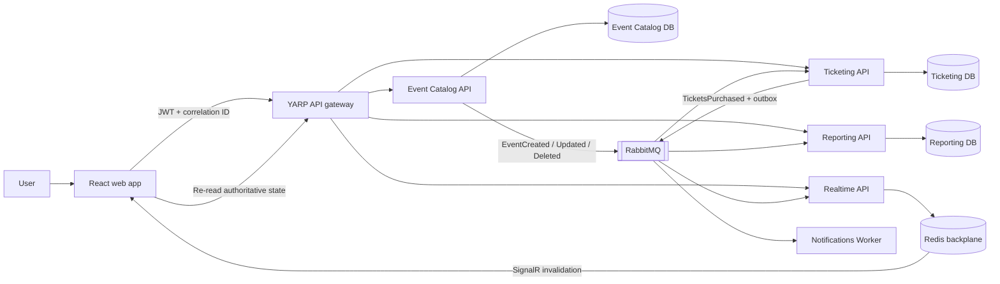

# EventFlow

> A production-minded, event-driven ticketing platform built for Ripple craft exercise.

EventFlow supports event CRUD, tiered ticket purchasing, authoritative availability, oversell prevention,
sales reporting, realtime browser updates, authentication, and end-to-end observability. Everything runs
locally through Docker Compose; no cloud account or paid service is required.

## Tech Stack at a glance

| Area | Implementation |
| --- | --- |
| APIs | .NET 8 / ASP.NET Core |
| Web | React, TypeScript, Vite |
| Transactional data | PostgreSQL with EF Core |
| Messaging | RabbitMQ with MassTransit |
| Reliability | Transactional outbox, consumer inbox, idempotency |
| Authentication | Keycloak using OAuth 2.0 / OpenID Connect |
| Realtime | SignalR with a Redis backplane |
| Gateway | YARP reverse proxy |
| Observability | Serilog, Seq, OpenTelemetry, Jaeger |
| Local environment | Docker Compose |

## EventFlow System Workflow



### A purchase transaction end-2-end

1. The browser sends a purchase with an `Idempotency-Key`.
2. Ticketing validates the event, pricing tier, quantity, buyer, and event state.
3. PostgreSQL conditionally increments `tickets_sold` only when enough capacity remains.
4. The inventory update, purchase, and outgoing outbox messages commit in one transaction.
5. The API returns `201 Created`; if insufficient inventory API returns `409 Conflict`.
6. The outbox publishes `TicketsPurchasedV1` to RabbitMQ after the commit.
7. Reporting and Notifications process the message using inbox deduplication.
8. Realtime sends a SignalR invalidation and browsers retrieve current source of truth data.

The database is the concurrency authority. No process-local lock is required, so adding API replicas does
not weaken oversell protection.

## Setup EventFlow locally

### 1. Install prerequisites

Required:

- [Docker Desktop](https://www.docker.com/products/docker-desktop/) with Docker Compose v2
- Git
- Approximately 6 GB of memory available to Docker

Optional for running outside containers:

- .NET 8 SDK
- Node.js 20 or newer

Confirm Docker is available:

```powershell
docker --version
docker compose version
docker info
```

Docker Desktop must be running before continuing.

Note: If installing Docker for the first time

Confirm Windows Subsystem for Linux (WSL) is installed

```powershell
wsl --install
```

Make sure to perform a restart after installation of Docker and WSL

### 2. Open the repository root

All commands in this guide run from the directory containing `docker-compose.yml`:

```powershell
cd Event_Ticketing_API_Submission-Docker-Messaging
```

### 3. Check for port conflicts

The local stack uses these ports:

```text
3000, 5432, 5672, 6379, 8080, 8180,
4317, 4318, 5101-5105, 5341, 15672, 16686
```

If one is already occupied, stop the conflicting application or change the corresponding Compose port
mapping.

### 4. Configure local credentials (optional)

Compose includes safe local-development defaults. To customize them, create `.env` from the example:

```powershell
Copy-Item .env.example .env
```

macOS or Linux:

```bash
cp .env.example .env
```

Do not commit real credentials. The included values are for local demonstration only.

### 5. Build and start the stack

The provided startup script runs Compose in the background.

Windows PowerShell:

```powershell
.\scripts\start.ps1
```

macOS or Linux:

```bash
./scripts/start.sh
```

Equivalent direct command:

```powershell
docker compose up --build -d
```

The first run downloads images and restores NuGet and npm packages, so it can take several minutes.

### 6. Verify startup

Check container state:

```powershell
docker compose ps
```

Follow startup logs if a service is not ready:

```powershell
docker compose logs -f --tail 100
```

Useful health checks:

```text
http://localhost:5101/health/ready
http://localhost:5102/health/ready
http://localhost:5103/health/ready
http://localhost:5105/health/ready
```

### 7. Open the application

Open [http://localhost:3000](http://localhost:3000) and sign in with a demonstration account:

| Username | Password | Access |
| --- | --- | --- |
| `admin` | `Demo123!` | Event administration, purchasing, reports |
| `buyer` | `Demo123!` | Purchasing |
| `analyst` | `Demo123!` | Reports |

These accounts are imported into the local Keycloak realm automatically.

### 8. Run the demonstration workflow

1. Sign in as `admin`.
2. Create an event with General Admission and VIP tiers.
3. Select the event and allow a moment for the Ticketing and Reporting projections.
4. Purchase tickets.
5. Confirm that availability and gross revenue update.
6. Retry the same logical purchase to demonstrate idempotency.
7. Attempt to exceed remaining capacity and observe `409 Conflict`.
8. Optionally open a second browser to see SignalR-driven updates.

Immediately after event creation, availability or reporting can briefly return `404` while RabbitMQ
delivers the projection message. That is expected eventual consistency; Ticketing becomes authoritative
once its event projection is available.

## Local endpoints

| Capability | URL |
| --- | --- |
| Web application | [http://localhost:3000](http://localhost:3000) |
| API gateway | [http://localhost:8080](http://localhost:8080) |
| Event Catalog Swagger | [http://localhost:5101/swagger](http://localhost:5101/swagger) |
| Ticketing Swagger | [http://localhost:5102/swagger](http://localhost:5102/swagger) |
| Reporting Swagger | [http://localhost:5103/swagger](http://localhost:5103/swagger) |
| RabbitMQ management | [http://localhost:15672](http://localhost:15672) |
| Seq logs | [http://localhost:5341](http://localhost:5341) |
| Jaeger traces | [http://localhost:16686](http://localhost:16686) |
| Keycloak | [http://localhost:8080/identity](http://localhost:8080/identity) |

Local infrastructure credentials:

| Service | Username | Password |
| --- | --- | --- |
| RabbitMQ | `ticketing` | `ticketing_password` |
| Keycloak administration | `localadmin` | `localadmin_password` |

## Stop or reset the environment

Stop containers while preserving database and broker data:

```powershell
.\scripts\stop.ps1
```

or:

```powershell
docker compose down
```

Remove containers and named volumes for a completely clean environment:

```powershell
docker compose down --volumes
```

> Removing volumes permanently deletes local EventFlow databases, RabbitMQ state, Redis state, and Seq data.

## REST API versioning

The UI now calls `http://localhost:8080/api/v1/...`. V1 is the only supported REST version.
All REST clients must specify V1 in the URL. Unversioned `/api/...` URLs return `404`.
The gateway forwards the version unchanged; each service selects and validates its supported version.

| Capability | Canonical V1 route |
| --- | --- |
| List/create events | `/api/v1/events` |
| Get/update/delete an event | `/api/v1/events/{eventId}` |
| Purchase tickets | `/api/v1/events/{eventId}/tickets` |
| Retrieve a purchase | `/api/v1/events/{eventId}/tickets/{purchaseId}` |
| Event availability | `/api/v1/events/{eventId}/availability` |
| All-event availability | `/api/v1/events/availability` |
| Sales summary | `/api/v1/reports/events/{eventId}/sales` |

Only the URL segment selects the REST version; query parameters and headers do not select versions.
Unsupported URL versions, such as `/api/v2/events`, return `404` rather than falling back to V1.
The supported version is reported in `api-supported-versions`. Swagger at each API's
`/swagger` lists only concrete V1 paths. Create responses use canonical versioned
`Location` links (V1 may be formatted as `v1.0`, which is equivalent to `v1`).
Identity (`/identity`), SignalR (`/hubs`), health checks, and message contract versions are unchanged.

For a future breaking change, introduce separate `[ApiVersion("2.0")]` controllers and V2 request/response
contracts using the versioned route template and register a V2 Swagger document.
Require an explicit URL version for every supported REST contract. Share business services where semantics are unchanged.
Keep database changes compatible with all active versions, test both contracts, and announce a migration
and retirement policy before removing V1. No V2 endpoint is implemented yet.

The separate clone does not automatically replace a running Docker stack. To apply these changes locally,
run `docker compose up --build -d` from this repository; the Compose project name and ports match the original.

## Build and test

Build the complete .NET solution:

```powershell
dotnet build EventTicketing.sln
```

Run the unit tests:

```powershell
dotnet test tests/EventCatalog.UnitTests
dotnet test tests/Ticketing.UnitTests
```

Run HTTP versioning and gateway routing tests (no Docker required):

```powershell
dotnet test tests/Api.VersioningTests
```

These tests run real controllers, authorization, version selection, Swagger, and YARP routing in an
in-process HTTP host. They use service stubs and an in-memory reporting store; database correctness is
covered by the separate container integration suite.

After rebuilding the Docker services, run the deployed versioning smoke check in PowerShell 7:

```powershell
pwsh -File scripts/validate-versioning.ps1
```

It uses the local demo administrator to verify authentication, V1 routes, rejection of unversioned URLs, Swagger,
resource links, purchases, idempotent retries, inventory, and asynchronous sales projections.
It creates a temporary event and deletes it afterward; its test purchase remains in the local audit data.

The integration suite starts real PostgreSQL and RabbitMQ containers through Testcontainers, so Docker must
be running:

```powershell
dotnet test tests/Ticketing.IntegrationTests
```

### What the integration tests verify

The integration suite exercises the Ticketing API against real PostgreSQL and RabbitMQ containers rather than
database or broker mocks. Each run creates isolated infrastructure and verifies the following behaviors:

| Integration test | What it verifies |
|---|---|
| **Concurrent inventory protection** | Sends 10 purchases concurrently against a tier with capacity 5. Exactly 5 requests must succeed, 5 must return `409 Conflict`, and availability must end at zero without overselling. |
| **Repeated idempotency key** | Submits the same purchase twice with one `Idempotency-Key`. Both responses must reference the same purchase, the second must be marked as replayed, and inventory must decrease only once. |
| **Idempotency payload conflict** | Reuses an existing idempotency key with different purchase details. The API must return `409 Conflict` and must not reserve additional inventory. |
| **Concurrent idempotent retries** | Sends five simultaneous copies of one purchase using the same idempotency key. Every response must resolve to one purchase ID and inventory must decrease only once. |
| **Inventory summary accuracy** | Creates multiple events, purchases from one event, and verifies that the summary endpoint reports the correct capacity, sold count, and remaining inventory for every event. |
| **Poison-message error queue** | Runs a consumer that always fails, verifies the configured retry attempts, and confirms that MassTransit moves the message to the endpoint's `_error` queue while preserving its message and correlation IDs. |

Together, these tests cover the highest-risk distributed-system behaviors: concurrency, overselling prevention,
request idempotency, persisted inventory accuracy, RabbitMQ retry handling, and poison-message isolation.

Run the complete suite with coverage:

```powershell
dotnet test EventTicketing.sln --collect:"XPlat Code Coverage"
```

Build the web application directly:

```powershell
cd src/Web/ticketing-web
npm ci
npm run build
```

## API examples

Complete executable examples are available in [EventTicketing.http](EventTicketing.http).

The primary routes exposed through the gateway are:

| Method | Route | Purpose |
| --- | --- | --- |
| `GET` | `/api/v1/events` | List events |
| `POST` | `/api/v1/events` | Create an event |
| `GET` | `/api/v1/events/{eventId}` | Retrieve an event |
| `PUT` | `/api/v1/events/{eventId}` | Update an event |
| `DELETE` | `/api/v1/events/{eventId}?version={version}` | Delete an event |
| `POST` | `/api/v1/events/{eventId}/tickets` | Purchase tickets |
| `GET` | `/api/v1/events/{eventId}/availability` | Read authoritative availability |
| `GET` | `/api/v1/reports/events/{eventId}/sales` | Read the sales summary |

Purchase requests require an `Idempotency-Key` header. Reusing the key with the same authenticated buyer
and canonical request returns the original purchase. Reusing it for different purchase semantics returns
`409 Conflict`.

## Correctness and reliability

- **No overselling:** a conditional PostgreSQL update atomically checks and reserves inventory.
- **Atomic purchase:** inventory, purchase, and outbox records commit in one transaction.
- **Safe retries:** a unique idempotency key prevents duplicate purchases.
- **Reliable publication:** the transactional outbox closes the database/message dual-write gap.
- **Duplicate protection:** consumer inbox records prevent repeated business effects.
- **Ordered projections:** catalog versions prevent older event messages from replacing newer state.
- **Predictable failures:** APIs return appropriate status codes and RFC-style `ProblemDetails`.
- **Horizontal scale:** stateless APIs coordinate through PostgreSQL, RabbitMQ, and Redis.

## Service ownership

| Component | Owns |
| --- | --- |
| Event Catalog API | Event definitions, versions, and pricing tiers |
| Ticketing API | Authoritative inventory and purchases |
| Reporting API | Eventually consistent sales projections |
| Notifications Worker | Simulated durable purchase confirmations |
| Realtime API | Authenticated SignalR invalidations |
| Gateway | Stable external routing surface |
| React UI | User workflows and projection reconciliation |

Services do not read each other's tables. One local PostgreSQL server reduces setup cost, but each service
uses its own database and credentials.

## Application data models

Each service owns its own PostgreSQL database. Services do not directly query or join tables belonging to
another service.

| Service | Database table | Table Fields | Constraints and relationships | Purpose |
| --- | --- | --- | --- | --- |
| **Event Catalog** | `events` | `Id`, `Name`, `Description`, `Venue`, `StartsAtUtc`, `TotalCapacity`, `Version`, `CreatedAtUtc`, `UpdatedAtUtc` | `Id` is the primary key. `Version` is an optimistic-concurrency token. `StartsAtUtc` is indexed. | Stores the official event definition and lifecycle information. |
| **Event Catalog** | `pricing_tiers` | `Id`, `EventId`, `Name`, `Price`, `Capacity` | `Id` is the primary key. `EventId` references `events`. An event and tier-name combination must be unique. Deleting an event deletes its tiers. | Defines ticket categories such as General Admission, VIP, or Premium. |
| **Ticketing** | `inventory_events` | `Id`, `Name`, `StartsAtUtc`, `TotalCapacity`, `CatalogVersion`, `IsActive` | `Id` is the primary key. `StartsAtUtc` is indexed. Contains a local projection of an Event Catalog event. | Stores the event information required to validate purchases and manage inventory. |
| **Ticketing** | `inventory_tiers` | `Id`, `EventId`, `Name`, `Price`, `Capacity`, `TicketsSold`, `IsActive` | `Id` is the primary key. `EventId` references `inventory_events`. The event and active-status combination is indexed. | Holds the source-of-truth inventory for each pricing tier. |
| **Ticketing** | `ticket_purchases` | `Id`, `EventId`, `PricingTierId`, `PricingTierName`, `CustomerEmail`, `BuyerSubject`, `IdempotencyKey`, `Quantity`, `UnitPrice`, `TotalPrice`, `CorrelationId`, `PurchasedAtUtc` | `Id` is the primary key. `IdempotencyKey` is unique. Event and purchase-time fields are indexed together. | Stores completed purchases and provides the record used for idempotent request replay. |
| **Reporting** | `event_sales` | `EventId`, `EventName`, `StartsAtUtc`, `TotalCapacity`, `TicketsSold`, `GrossRevenue`, `CatalogVersion`, `IsActive` | `EventId` is the primary key. Updated asynchronously from RabbitMQ messages. | Provides an event-level sales projection optimized for reporting queries. |
| **Reporting** | `tier_sales` | `PricingTierId`, `EventId`, `Name`, `Capacity`, `TicketsSold`, `GrossRevenue`, `IsActive` | `PricingTierId` is the primary key. `EventId` references `event_sales` and is indexed. Deleting an event projection deletes its tier projections. | Provides sales and revenue totals for each pricing tier. |
| **Notifications** | `notifications` | `Id`, `PurchaseId`, `Recipient`, `Subject`, `Body`, `Status`, `CreatedAtUtc` | `Id` is the primary key. `PurchaseId` is unique, preventing duplicate notifications for the same purchase. | Records purchase notifications created by the Notifications worker. |

### Main data relationships

| Parent model | Child model | Relationship |
| --- | --- | --- |
| Event Catalog `events` | Event Catalog `pricing_tiers` | One event has many pricing tiers. |
| Ticketing `inventory_events` | Ticketing `inventory_tiers` | One inventory event has many inventory tiers. |
| Reporting `event_sales` | Reporting `tier_sales` | One event-sales projection has many tier-sales projections. |
| Ticketing `ticket_purchases` | Notifications `notifications` | One purchase produces at most one persisted notification. This is a cross-service logical relationship, not a database foreign key. |

### Derived values

| Value | Calculation | Stored? |
| --- | --- | --- |
| Available tickets per tier | `Capacity - TicketsSold` | Calculated when returned by the API |
| Available tickets per event | `TotalCapacity - TicketsSold` | Calculated when returned by the API |
| Purchase total | `Quantity × UnitPrice` | Stored in `ticket_purchases.TotalPrice` |
| Event sell-through | `TicketsSold ÷ TotalCapacity × 100` | Calculated by the analyst UI |
| Tier sell-through | `Tier TicketsSold ÷ Tier Capacity × 100` | Calculated by the analyst UI |

### Messaging support tables

Event Catalog, Ticketing, Reporting, and Notifications also contain MassTransit-managed tables:

| Technical model | Purpose |
| --- | --- |
| `OutboxMessage` | Stores outgoing messages until they are successfully published. |
| `OutboxState` | Tracks transactional outbox delivery progress. |
| `InboxState` | Records consumed messages to prevent duplicate processing. |

The Gateway and Realtime services do not own business databases. The Gateway routes requests, while Realtime
broadcasts SignalR invalidations and uses Redis for cross-instance delivery.

## Project structure

```text
.
|-- src/
|   |-- BuildingBlocks/       Shared contracts and platform defaults
|   |-- Gateway/              YARP API gateway
|   |-- Services/
|   |   |-- EventCatalog/     Event CRUD and pricing definitions
|   |   |-- Ticketing/        Inventory and purchases
|   |   |-- Reporting/        Sales projections
|   |   |-- Notifications/    Purchase notification worker
|   |   `-- Realtime/         SignalR notifications
|   `-- Web/                  React application
|-- tests/                    Unit and integration tests
|-- infrastructure/           PostgreSQL, Keycloak, and telemetry configuration
|-- scripts/                  Cross-platform start and stop helpers
|-- docs/                     Architecture and interview material
|-- docker-compose.yml        Complete local environment
```

## Troubleshooting
### Docker reports virtualization error 

Check if hardware virtualization is enabled and Windows Subsystem for Linux is installed (WSL)
`wsl --install`

### Docker reports that a port is already allocated

Find and stop the process using the port, or modify the host-side port in `docker-compose.yml`.

### Availability or reporting returns 404 after creating an event

Wait briefly and retry. Event definitions are projected asynchronously through RabbitMQ.

### Authentication redirects repeatedly

Confirm the gateway and Keycloak containers are running, then clear site data for `localhost:3000` and sign
in again.

### A service does not become ready

Inspect its logs:

```powershell
docker compose logs --tail 200 <service-name>
```

Then inspect PostgreSQL and RabbitMQ health:

```powershell
docker compose ps postgres rabbitmq
```

### Resetting did not clear old data

Use `docker compose down --volumes`, then rebuild. This is destructive to local development data.

## Design decisions and trade-offs

| Design decision | Why it was chosen | Trade-off |
|---|---|---|
| **Single-instance local infrastructure** | PostgreSQL, RabbitMQ, Redis, and Keycloak run locally, allowing the application to demonstrate enterprise architectural patterns without relying on external cloud infrastructure. | Production requires clustering or managed services, backups, TLS, secrets management, alerting, and disaster recovery. |
| **Business-aligned microservices** | Event Catalog, Ticketing, Reporting, Notifications, and Realtime each own a focused business capability and can be deployed or scaled independently. | Introduces more network communication, infrastructure, monitoring, and operational complexity than a monolith. |
| **Database per service** | Each service controls its own data and does not directly query another service's database. | Some information is duplicated, cross-service joins are avoided, and projections may be temporarily out of date. |
| **API gateway** | The browser uses one address while the gateway uses YARP to route requests to the appropriate internal service. | The gateway becomes important infrastructure that must be secured, monitored, and scaled. |
| **Role-based access control (RBAC)** | Keycloak authenticates users and assigns the `event-admin`, `ticket-buyer`, and `report-reader` roles. Each API independently validates tokens and enforces its own authorization rules. | Adds identity configuration and repeated token validation across services. |
| **Event-driven architecture** | RabbitMQ and MassTransit keep services loosely coupled, allow consumers to scale independently, and prevent a failed downstream service from blocking a successful purchase. | Reporting and notifications are eventually consistent and may update shortly after the purchase. Messaging also introduces broker operations and failure-handling requirements. |
| **Structured observability** | Correlation IDs, structured logs, Seq, health endpoints, and OpenTelemetry help trace requests and messages across services. | Adds telemetry processing, storage, configuration, and operational cost. |
| **Strongly consistent inventory** | Ticketing is the source of truth for availability. Conditional database updates prevent concurrent requests from overselling tickets. | Popular ticket tiers can create database contention during periods of high demand. |
| **Transactional outbox** | Database changes and outgoing messages are saved in the same transaction, preventing committed purchases from losing their integration events. | Publishing is asynchronous, introduces a small delay, and requires outbox-table monitoring. |
| **Idempotent purchase requests** | Retries reuse the same `Idempotency-Key`, returning the original result instead of creating another purchase. | Idempotency records must be stored and checked. Reusing a key with different purchase details must return a conflict. |
| **Bounded message retries** | Temporary consumer failures are retried automatically without retrying indefinitely. | Retry delays increase processing time, and the policy must be tuned to avoid unnecessary load. |
| **MassTransit `_error` queues** | Permanently failing messages are isolated so they do not block healthy messages. Final failures are logged for investigation. | Error queues require monitoring, alerting, investigation, and a controlled replay procedure. |
| **Realtime updates** | SignalR tells browsers that data changed, and browsers retrieve the latest value from the owning API. | Requires an additional API call but remains correct with duplicated, delayed, missed, or out-of-order notifications. |

For deeper technical detail, see:

- [Architecture and design decisions](docs/ARCHITECTURE.md)
- [HTTP request collection](EventTicketing.http)

## Security note

The included users, passwords, HTTP endpoints, and development settings are intentionally local. Do not deploy
them unchanged. Production environments should use HTTPS, a secret manager, hardened identity configuration,
database and broker TLS, edge rate limiting, and reviewed authorization policies.
