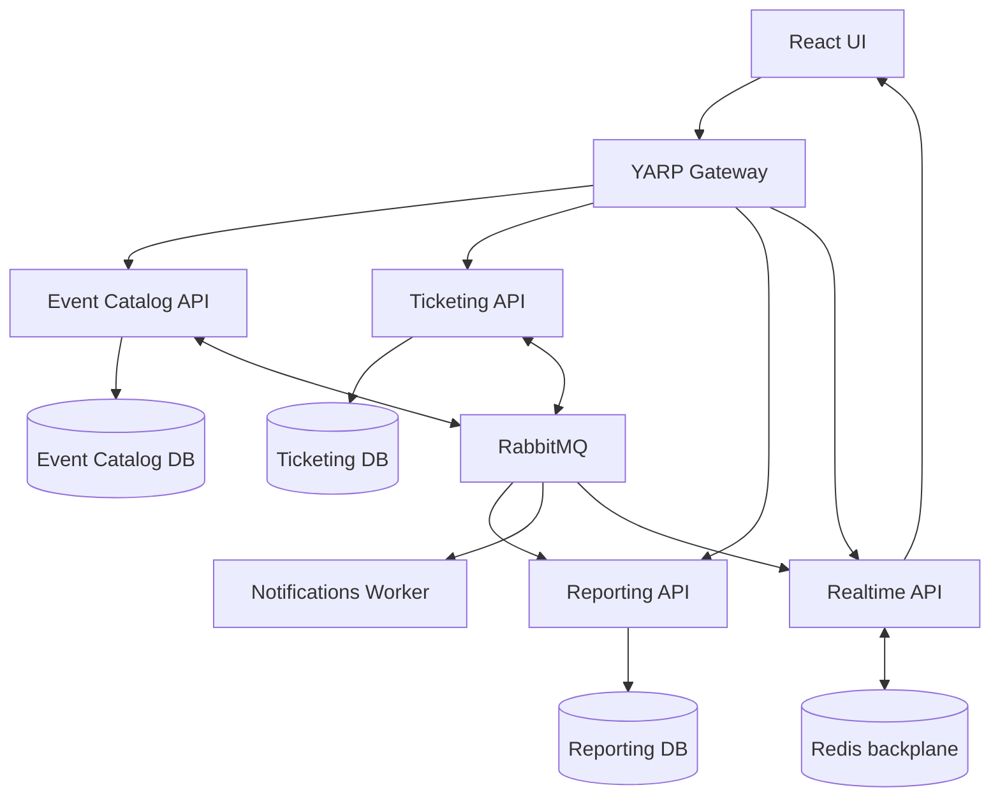
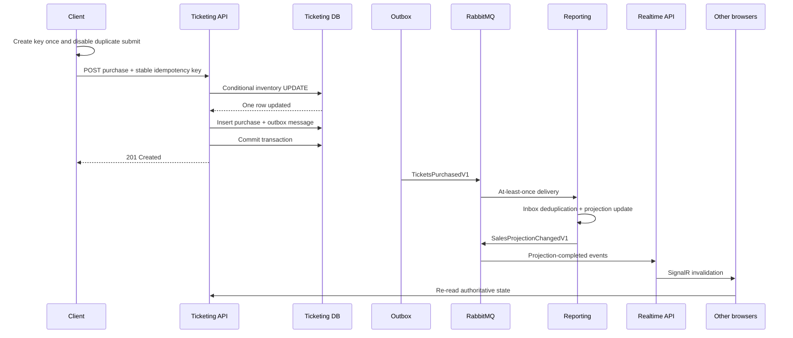
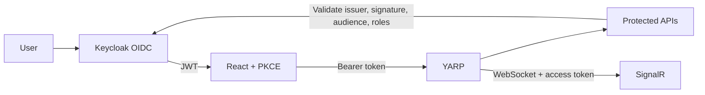

# Architecture and design decisions

## Context

The case study asks for RESTful event management, ticket purchases, availability, oversell prevention,
reporting, validation, tests, documentation, and scalability considerations. EventFlow implements the
transactional requirements synchronously and propagates cross-service state asynchronously.



## REST contract versions

`Asp.Versioning.Mvc` selects V1 from `/api/v{version:apiVersion}/...` routes. Every REST request
requires an explicit URL version. The UI uses `/api/v1`, and YARP preserves the version when forwarding to
Event Catalog, Ticketing, or Reporting. Unversioned URLs and unsupported versions return 404.
The version-aware API explorer publishes only concrete V1 URLs in Swagger.
A future V2 gets separate controllers and contracts while V1 remains available during client migration.
REST API versions are independent of the `V1` integration message names and catalog record versions.

## Service ownership

| Service | Source of truth | Consumes | Publishes |
| --- | --- | --- | --- |
| Event Catalog | Event metadata and pricing definitions | None | `EventCreatedV1`, `EventUpdatedV1`, `EventDeletedV1` |
| Ticketing | Inventory counters and purchases | Event lifecycle messages | `TicketsPurchasedV1`, `InventoryProjectionChangedV1` |
| Reporting | Event/tier sales projections | Event lifecycle and purchase messages | `SalesProjectionChangedV1` |
| Notifications | Durable simulated notification records | `TicketsPurchasedV1` | None |
| Realtime | Authenticated client notifications | Catalog and projection-changed messages | SignalR notifications |

Shared code contains only stable message contracts and cross-cutting platform behavior. Domain entities and
database models are not shared between services.

## Purchase consistency boundary



The reservation statement changes a tier only when:

```text
capacity - tickets_sold >= requested_quantity
```

The condition and increment remain one database statement. Purchases and catalog consumers also take the same
PostgreSQL transaction-scoped advisory lock by event ID before reading inventory. This coordinates event-wide
capacity, tier changes, price changes, and eligibility across replicas. Purchases check total sales across
all tiers, including retired tiers, against the event capacity. A busy event serializes its inventory writes;
different events can proceed independently.

Tier updates identify existing tiers by ID, never by their mutable name. Omit the ID only for a new tier.
Event and existing-tier capacities can be increased but cannot be reduced, and existing tiers cannot be
removed. Event Catalog cannot know synchronously how many tickets Ticketing has committed, so this monotonic
capacity policy prevents the catalog definition from falling below sold inventory without coupling the services.
Purchase requests must include `expectedUnitPrice`; a changed price returns 409 without reserving inventory.
The browser preserves the accepted price and idempotency key together for retries. An original purchase can
still be replayed after a later price change. Catalog propagation remains asynchronous: the quote is checked
against Ticketing's committed state, not a synchronous cross-service catalog read.

## Delivery guarantees

RabbitMQ and MassTransit provide at-least-once delivery. “Exactly once” is achieved at the observable business
level through idempotency:

- Every service has independently named subscription queues. An integration event is copied to each subscribed
  service queue; replicas of the same service use competing consumers on that queue for horizontal scaling.

- The producer outbox prevents lost events after a successful business commit.
- The consumer inbox prevents a redelivered message from updating a projection twice.
- The purchase idempotency key prevents a retried HTTP request from reserving inventory twice.
- Unique database constraints are the final race-condition defense.

The React client creates an idempotency UUID at the beginning of an intended purchase and reuses it for three
bounded attempts when the failure is transient. Each HTTP attempt still receives a fresh correlation ID, which
preserves attempt-level observability without changing the identity of the business command. If all automatic
attempts have an ambiguous result, the visible **Retry purchase** action retains the same key. The Ticketing API
compares the authenticated buyer and canonical request fields before replaying the original response, exposes
`Idempotency-Replayed: true`, and returns `409` if a key is reused with different purchase semantics.

After configured retries are exhausted, MassTransit moves a message to its endpoint's `_error` queue, retaining
the exception headers and original body. Operators inspect the trace/correlation ID, repair the cause, then
replay the message rather than discarding it.
MassTransit publishes `Fault<T>` only after retries are exhausted. The Notifications fault consumer logs the
message type, message ID, correlation ID, exception details, and `RetryExhausted = true`. Operational recovery
follows the controlled process in [`DEAD_LETTER_RUNBOOK.md`](DEAD_LETTER_RUNBOOK.md).

## Data and query model

Event Catalog and Ticketing use normalized transaction models. Reporting uses a purpose-built projection so
reads do not join across services or synchronously fan out. This resembles CQRS at the system level without
introducing a command framework where it is not needed.

The UI treats the Event Catalog's `totalCapacity` as event-definition data and Ticketing's `available` value as
the authoritative live inventory. The sidebar obtains all remaining counts through one Ticketing batch query,
`GET /api/v1/events/availability`, instead of issuing one request per event.

Real-time messages are invalidations, not state-transfer commands. Ticketing publishes
`InventoryProjectionChangedV1` only after authoritative inventory commits; Reporting publishes
`SalesProjectionChangedV1` only after its projection commits. Realtime API consumes those messages and broadcasts
small SignalR notifications. Each browser then performs a targeted API read, which avoids incorrect client-side
delta arithmetic after reconnects, duplicates, or out-of-order delivery. A 60-second reconciliation is a safety
net rather than the primary update mechanism.

Date/time values use UTC `DateTimeOffset`. Money uses fixed-precision PostgreSQL numerics and .NET `decimal`.
Identifiers are client-opaque GUIDs. Catalog versions prevent stale writes and old integration events from
overwriting newer projections.
Deletion consumers persist inactive versioned records even if the creation message has not arrived, so older
creation/update messages cannot reactivate a deleted event. Capacity reductions below existing sales preserve
those sales for compatibility with previously published messages but leave no remaining event inventory.
Reporting serializes catalog and purchase projection mutations with the same event-scoped transaction-lock
pattern, preventing concurrent consumers from replacing a newer catalog version or calculating capacity from
stale sales.

## Security model



The browser never holds a client secret. `event-admin`, `ticket-buyer`, and `report-reader` provide focused
authorization. Authentication can be disabled explicitly in Development or Testing, which substitutes a
test identity; other environments reject that configuration at startup. WebSocket transports carry the short-lived bearer
token in the SignalR connection query string, so informational YARP forwarding logs are suppressed to prevent
the token-bearing target URI from being written to Seq.

## Scaling path

1. Scale stateless APIs independently based on latency and request rate.
2. Scale consumers with competing instances; partition high-volume projections by event ID if ordering becomes
   important within an event.
3. Add PostgreSQL read replicas only where measured read load requires them.
4. Cluster RabbitMQ with quorum queues and publisher confirms in production.
5. Scale Realtime API behind the Redis backplane; use a managed SignalR service when connection volume justifies it.
6. Apply checked-in migrations in a single deployment job before rolling out service replicas; see
   [database migrations](DATABASE_MIGRATIONS.md) for existing-database baselining and deployment commands.
7. Apply gateway rate limits, request-size limits, WAF controls, and distributed cache only after observing need.
8. Define SLOs for purchase success/latency, projection lag, outbox age, error-queue depth, and inventory conflicts.

## Alternatives considered

| Decision | Selected | Alternative | Why |
| --- | --- | --- | --- |
| Local broker | RabbitMQ | Kafka | Transactional work queues, routing, and a smaller demonstration footprint fit better than replayable streams. |
| Database | PostgreSQL | SQLite | PostgreSQL supports real concurrent writers, robust transactions, and production-like conditional updates. |
| Messaging abstraction | MassTransit | Raw RabbitMQ.Client | MassTransit supplies consistent endpoint conventions, retries, inbox/outbox, and test integration. |
| Security | Keycloak | Entra ID | Keycloak demonstrates OIDC and RBAC without an external tenant or cost. |
| Reporting | Event-built projection | Cross-service joins | Independent ownership and constant-time reads scale more predictably. |
| Inventory guard | Atomic SQL update | In-process lock | Database atomicity protects multiple replicas and restarts. |
| Browser updates | SignalR invalidation + authoritative read | Five-second polling or client-side deltas | Immediate updates with correct reconnect and duplicate behavior. |
| SignalR scale-out | Redis backplane | Single-instance in-memory fan-out | Clients connected to any Realtime replica receive the same notification. |
